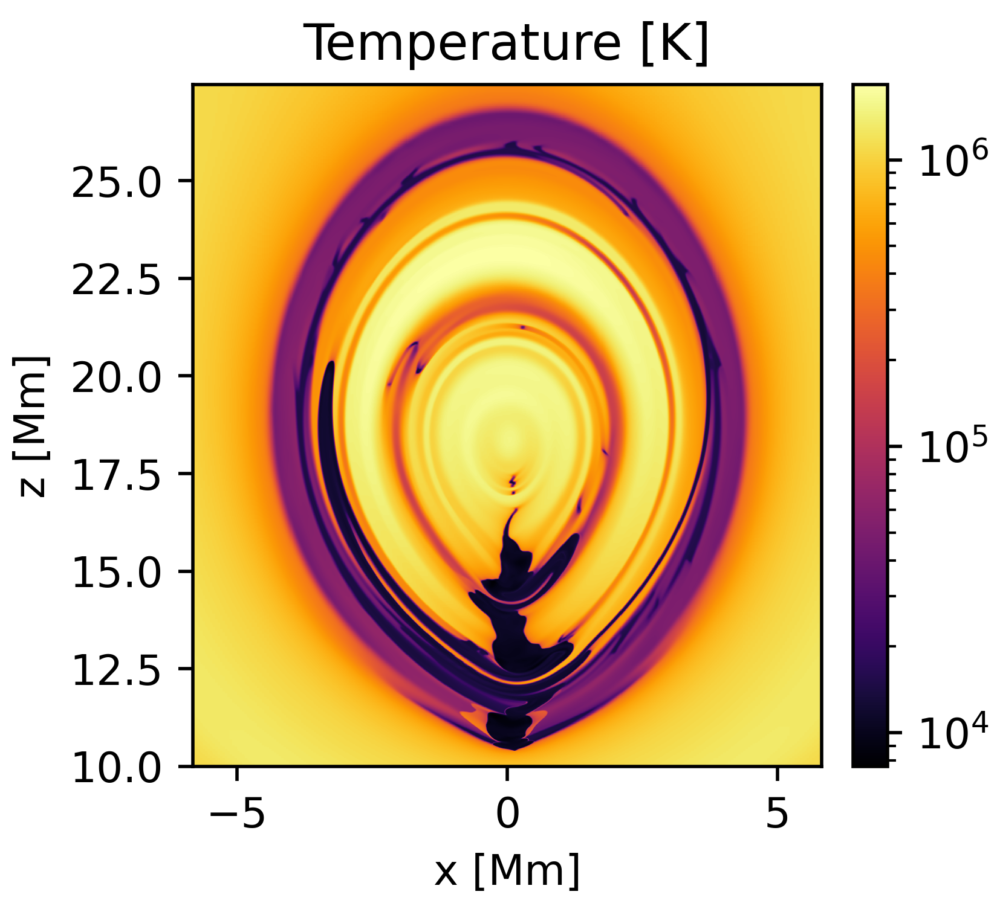
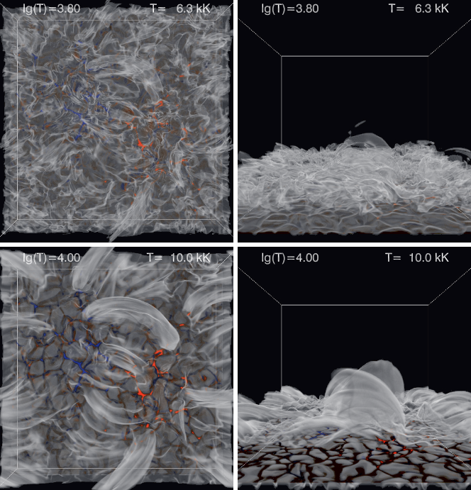
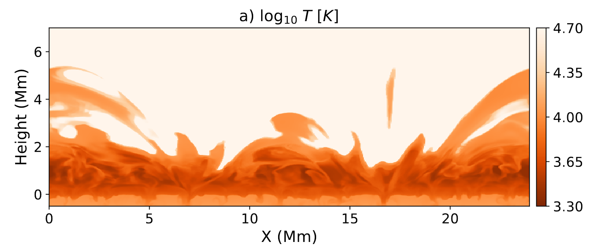
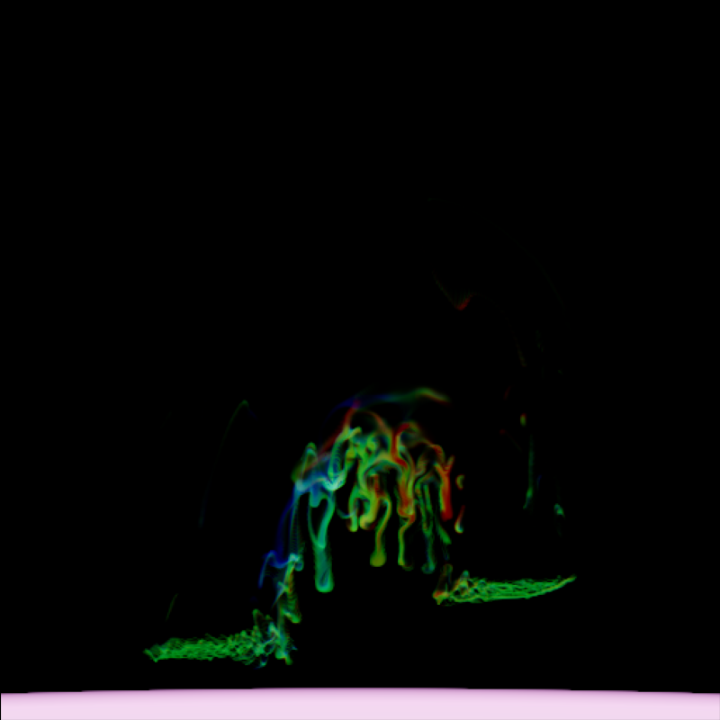

## Non-LTE Radiative Transfer {.smaller}

:::: {.columns .v-center-container}

::: {.column width="50%"}
- Coupling between radiation field and atomic transitions.
- Extremely computationally demanding, but necessary for many spectral lines.
- Needed for models, diagnostics, and inversions.
- Also, ionisation.
:::

::: {.column width="50%"}
<video loop data-autoplay src="static_assets/HinodeProm.mp4" width="99%"></video>

[HINODE BFI]{.attrib}
:::

::::

## Most Important Quantities {.smaller}

::: {.v-center-container .horiz-center}

::: {.column}

- Radiative rates depend on intensity.
- Intensity depends on radiative rates.

:::{.fragment}
<br/>
```{=tex}
\begin{align*}
    J_\nu(\vec{p}) &= \frac{1}{4\pi}\oint_\mathbb{S^2} I_\nu(\vec{p},\hat{\omega}) \mathop{d \hat{\omega} } \\
    &\vec{p} \in \mathbb{R}^3, \hat{\omega} \in \mathbb{S}^2\\
\end{align*}
```

- Specific intensity and its first moment.
- 4 and 6 dimensional functions!
:::

:::

:::

## Non-LTE Radiative Transfer {.smaller}

:::: {.columns .v-center-container}

::: {.column width="50%"}
- 1.5D RT treats columns independently.

- More importantly, as having infinite extent in the horizontal plane.

::: {.incremental}
- 2+D RT codes designed around the idea of smooth atmospheres...
:::

::: {.incremental}
- But ours look like this:
:::
:::

::: {.column width="50%" .r-stack}

::: {.fragment .current-visible}
{style="max-width: 80%;"}

[Jenkins & Keppens 2021]{.attrib}
:::

::: {.fragment .current-visible}
{style="max-width: 80%;"}

[Carlsson+ 2016]{.attrib}
:::

::: {.fragment .current-visible}
{style="max-width: 80%;"}

[Przybylski+ 2022]{.attrib}
:::

:::

::::

## Ray Effects

{fig-align="center"}

## Desired Result

{fig-align="center"}

# How do we build this?

- Where else is light transport solved?
  - Physically Based Rendering

{{ PenumbraCriterion }}

## Penumbra Criterion {.smaller}

:::: {.columns .v-center-container}

::: {.column width="60%"}

```{=tex}
\begin{cases}
A < B,\\
\alpha > \beta.
\end{cases}
```
with some small angles approximations...
```{=tex}
\begin{cases}
\Delta_s < F(D) \propto D\quad&\mathrm{(spatial)}\\
\Delta_\omega < G(1/D) \propto 1/D\quad&\mathrm{(angular)}
\end{cases}
```

- We can exploit this!
- Represent contributions from different shells separately.

:::

::: {.column width="50%"}


:::
::::

## How do we use this? {.smaller}

::: {.columns .v-center-container}

::: {.column}
- Encode radiance field as a set of cascades, each describing $I_\nu$ in annuli around $\vec{p}$.
<!-- - If penumbra criterion is satisfied, cascade is linearly interpolateable! -->
- Exponential scaling of annulus width and angular sampling.
<!-- - A single radiation field sample $\mathcal{R}_{t_i, t_{i+1}}(\vec{p},\hat{\omega})$ termed radiance interval. -->
- But what do these cascades look like?

:::
:::

{{ ProbeGrid }}

## Probe Interpolation {.smaller}

::: {.columns .v-center-container}
::: {.column}
- This construction sparsely encodes the radiation field throughout the domain...
- But not in a form we can use directly.
- Solution:

::: {.horiz-center}
<br/>[Interpolation. But with minimal error.]{style="color: var(--teal_c);"}
:::
:::
:::

## Tower of Optimisations

- Mipmaps (with adaptive error bounds)

- MIPMAP PICTURE

- Sparsity and Cache-friendliness

- SPARSITY PICTURE


# Application

<!-- ## Application {.smaller}

::: {.horiz-center}
::: {}
<video controls loop data-autoplay src="static_assets/jk_3g_model.mp4" height="80%" style="max-width: 80%;"></video>
:::
[Jenkins & Keppens 2021]{.attrib}
::: -->

## Setup {.smaller}

<br/><br/>
{fig-align="center"}

::: {.attrib}
:::: {.columns}
::: {.column width=50%}
- 5.7 km resolution!
- 3072 x 2048
:::
::: {.column width=50%}
- 5+1 level H
- 5+1 level Ca ɪɪ
- Charge & pressure conservation
:::
::::
:::


<!-- ## Spectra -- Ca ɪɪ K {.smaller}

::: {.horiz-center}

<video controls loop data-autoplay src="static_assets/Ca_II_393.48_nm.mp4" style="max-width: 80%;"></video>

::: -->

## Spectra -- Ly β {.smaller}

::: {.horiz-center}

<video controls loop data-autoplay src="static_assets/H_I_102.57_nm.mp4" style="max-width: 80%;"></video>

:::

## Ionisation Fraction {.smaller}

{fig-align="center"}

## Sneak Peak {.smaller}

{fig-align="center"}

# Outlook

## Outlook {.smaller}

:::: {.columns .v-center-container}

::: {.column width=80%}
- Radiative transfer effects are necessary for realistic solar models
  - Observational interpretation
  - Model synthesis
  - Ionisation effects
- Radiance cascades present viable route to non-LTE RMHD
  - SAMS Project
- And also to enhance radiation treatment across astrophysics
- GPUs are really powerful, and graphics programming has lots to offer us

<br/><br/>
[Thanks!]{style="color: var(--teal_c);"}

[Christopher.Osborne@glasgow.ac.uk](mailto:christopher.osborne@glasgow.ac.uk)
:::

::: {.column width=20%}
[](https://doi.org/10.1093/rasti/rzae062)
[Paper]{.attrib}
:::

::::

