## Who recognises this? {.smaller}

::: {.horiz-center}

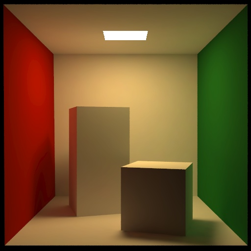{fig-align="center" height=520px}

[Cornell University]{.attrib}

:::

## And how does it connect to this? {.smaller}

::: {.horiz-center}

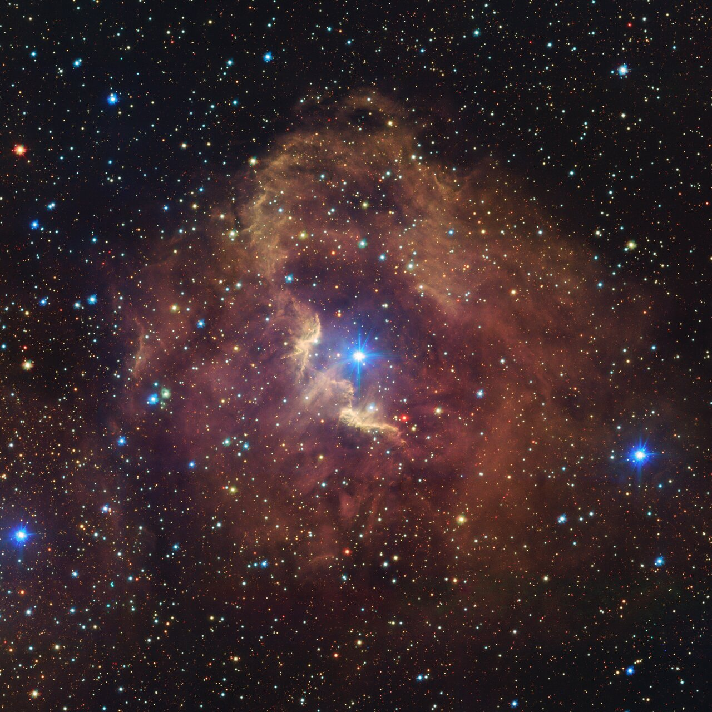{fig-align="center" height=520px}

[VLT (ESO)]{.attrib}

:::

## Physics! {.smaller}

```{=tex}
\begin{align*}
(\hat{\omega} \cdot \nabla) L(\vec{p}, \hat{\omega}) = &-\chi(\vec{p}, \hat{\omega}) L(\vec{p}, \hat{\omega}) \\
&+ \eta(\vec{p}, \hat{\omega}) \\
&+ \sigma_s(\vec{p}, \hat{\omega}) \oint_{\mathbb{S}^2} p(\vec{p}, \hat{\omega}^\prime, \hat{\omega}) L(\vec{p}, \hat{\omega}^\prime)\, d\hat{\omega}^\prime
\end{align*}
```

This hybrid notation will probably make everyone mad!

- $L$ radiance,
- $\eta$ emission coefficient,
- $\chi$ absorption coefficient,
- $\sigma_s$ scattering coefficient,
- $p$ phase function.


[Key takeaway: this is a recursive integro-differential equation!]{style="color: var(--teal_c);"}

## Non-LTE Radiative Transfer {.smaller}

:::: {.columns .v-center-container}

::: {.column width="50%"}
- Coupling between radiation field and atomic transitions.
- Extremely computationally demanding, but necessary for many spectral lines.
- Also, ionisation.
:::

::: {.column width="50%"}
<video loop data-autoplay src="static_assets/HinodeProm.mp4" width="99%"></video>

[HINODE BFI]{.attrib}
:::

::::

## Most Important Quantities {.smaller}

::: {.v-center-container .horiz-center}

::: {.column}

- Radiative rates depend on intensity.
- Intensity depends on radiative rates.

:::{.fragment}
<br/>
```{=tex}
\begin{align*}
    J_\nu(\vec{p}) &= \frac{1}{4\pi}\oint_\mathbb{S^2} I_\nu(\vec{p},\hat{\omega}) \mathop{d \hat{\omega} } \\
    &\vec{p} \in \mathbb{R}^2, \hat{\omega} \in \mathbb{S}^2\\
\end{align*}
```

- Specific intensity and its first moment.
- 3 and 5 dimensional functions! (+ wavelength...)
- Recursive component solved by fixed-point iteration in the atomic populations.
:::
:::
:::

## Monte Carlo

## Ray Effects

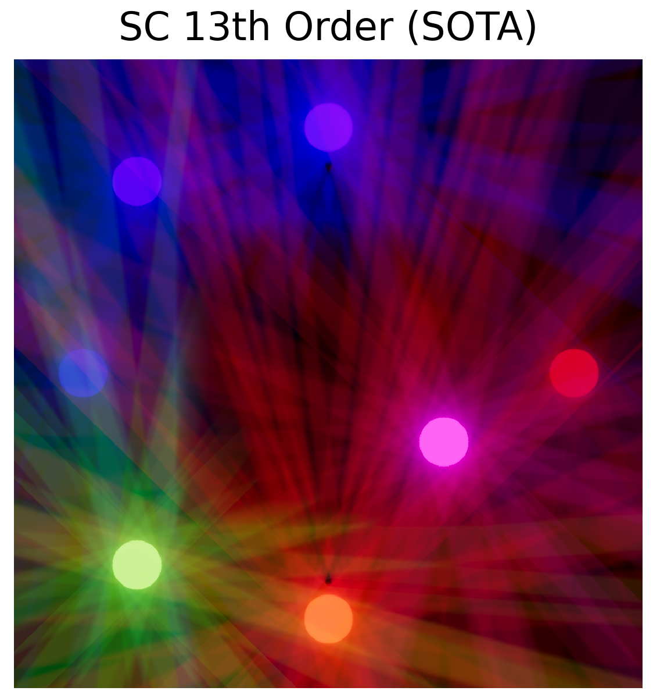{fig-align="center"}

## Desired Result

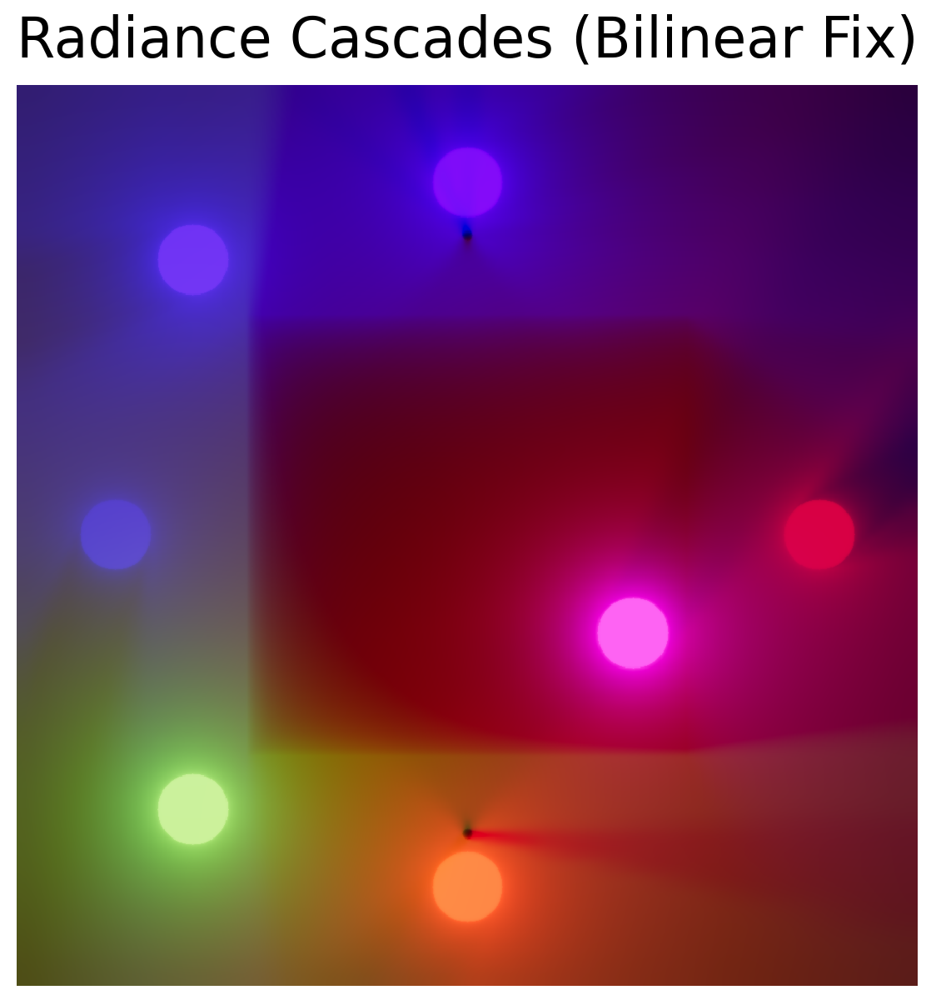{fig-align="center"}

## Tricky Radiation {.smaller}

::: {.columns .v-center-container}

:::: {.column width="80%"}

- In the steady-state solution of radiative transfer coupling is [global.]{style="color: var(--teal_c);"}
- This hinders parallelisation (and SC imposes its own additional dependencies even within a patch).
- Monte Carlo approaches have poor convergence rates.
- [Is there some middle ground?]{style="color: var(--teal_c);"}

::: {.fragment}
- Video games are now solving an adjacent problem at reasonable resolutions _hundreds_ of times a second on single workstations...
:::
::::
:::

# How do we build this?

{{ PenumbraCriterion }}

## Observations {.smaller}

:::: {.columns .v-center-container}

::: {.column width="60%"}

```{=tex}
\begin{cases}
A < B,\\
\alpha > \beta.
\end{cases}
```
with some small angles approximations...
```{=tex}
\begin{cases}
\Delta_s < F(D) \propto D\quad&\mathrm{(spatial)}\\
\Delta_\omega < G(1/D) \propto 1/D\quad&\mathrm{(angular)}
\end{cases}
```

- We can exploit this!
- Represent contributions from different shells separately.

:::

::: {.column width="50%"}

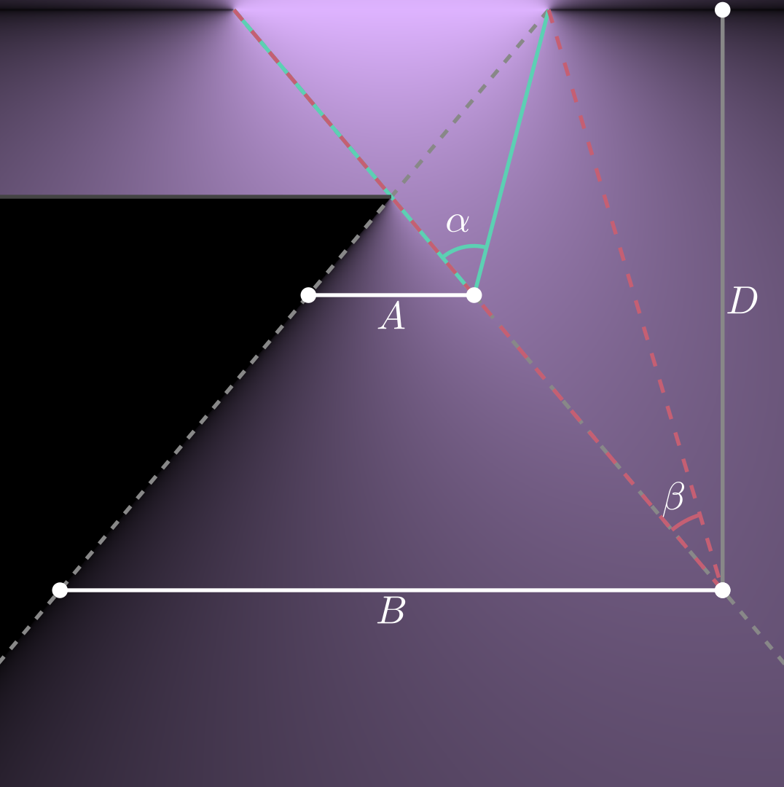

:::
::::

{{ LongCharView }}

{{ RcProbeNear }}

{{ RcProbeFar }}

## How do we use this? {.smaller}

::: {.columns .v-center-container}

::: {.column}
- Encode radiance field as a set of cascades, each describing $I_\nu$ in annuli around $\vec{p}$.
- If penumbra criterion is satisfied, cascade is linearly interpolateable!
- Simple (maybe not optimal) definition of cascade $i$ covering $[t_i, t_{i+1}]$, $\alpha \geq 1$:

```{=tex}
\begin{cases}
\Delta_s \propto 2^i,\\
\Delta_\omega \propto \cfrac{1}{2^{\alpha i}},\\
t_i \propto 2^{\alpha i}
\end{cases}
```

- Exponential scaling
- A single radiation field sample $\mathcal{R}_{t_i, t_{i+1}}(\vec{p},\hat{\omega})$ termed radiance interval.
- But what do these cascades look like?

:::
:::

{{ ProbeGrid }}

## Probe Interpolation {.smaller}

::: {.columns .v-center-container}
::: {.column}
- This construction sparsely encodes the radiation field throughout the domain...
- But not in a form we can use directly.
- Solution:

::: {.fragment .horiz-center}
<br/>[Interpolation. But with minimal error.]{style="color: var(--teal_c);"}
:::
:::
:::

{{ InterpolatedProbe }}

## Interpolated Ray Analysis {.smaller}

- Each cascade $i+1$ has 1/2 the rays of cascade $i$ (denoted $N_{C_i}$)
- By interpolation we construct $\mathcal{R}_{t_{i+1},t_{i+2}}(\vec{p},\hat{\omega})$ for each probe of cascade $i$ $\left([t_i, t_{i+1}]\right)$.
- Merging cascades 0 and 1:
```{=tex}
\begin{cases}
\text{Rays computed} = N_{C_0} + N_{C_1} = N_{C_0} + \cfrac{N_{C_0}}{2},\\
\text{Rays constructed} = 2N_{C_0}.
\end{cases}
```

::: {.fragment}
- In general:
```{=tex}
\begin{cases}
\text{Rays computed} = \sum_I N_{C_i} = \left(1 + \cfrac{1}{2} + \cdots + \cfrac{1}{2^I} \right) < 2N_{C_0},\\
\text{Rays constructed} = 2^I N_{C_0}.
\end{cases}
```
:::

::: {.fragment style="color: var(--teal_c);"}
Sublinear (bounded) scaling in compute, [exponential]{.fragment .red-shift} scaling in constructed rays!
:::

## Interpolated Ray Analysis cont'd {.smaller}

- For a branching factor $\alpha=2$ in 2D
- Each cascade has the same number of rays.
- Merging cascades 0 and 1:
```{=tex}
\begin{cases}
\text{Rays computed} = N_{C_0} + N_{C_1} = 2N_{C_0},\\
\text{Rays constructed} = 4N_{C_0}.
\end{cases}
```

::: {.fragment}
- In general:
```{=tex}
\begin{cases}
\text{Rays computed} = \sum_I N_{C_i} = I N_{C_0},\\
\text{Rays constructed} = 2^{2I} N_{C_0}.
\end{cases}
```
:::

::: {.fragment style="color: var(--teal_c);"}
Linear scaling in compute, exponential scaling in constructed rays!
:::
::: {.fragment style="color: var(--teal_c);"}
Somewhat better apparent quality (small angle approximation)
:::

## Tower of Optimisations {.smaller}

<br/>

- Sparsity and cache-friendliness
- Lower resolution proxies for distant rays: mipmaps with directionality and adaptive error bounds (variance of log emissivity and opacity)

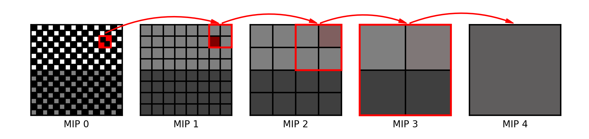{fig-align="center"}

- In practice, upper cascades (longer rays) sample upper MIPs (fewer texels) when variance is low enough.

## MIP Levels {.smaller}

::: {.horiz-center}

<video controls loop data-autoplay src="static_assets/lyb_blocks.mp4" style="max-width: 80%;"></video>

:::

## Machine Learning {.smaller}

::: {.columns}

<br/>

Myriad uses for hybrid models

<br/>

::: {.fragment data-fragment-index="0"}
1. Efficient wavelength integrals for $\bar{J}$, see Dias Baso+ 2023.
:::

::: {.fragment data-fragment-index="1"}
2. Direct evaluation of PRD scattering integral from $J$ and velocity field, similar to hybrid treatment of Leenaarts+ 2012
:::

::: {.fragment data-fragment-index="2"}
3. Initial guess at departure coefficients from atmospheric structure, (Vicente Arévalo+ 2022), or "smarter" acceleration of Rate Equation convergence...
:::

:::

## Playtime {.smaller}

<iframe data-src="./rc-demo.html" width=800 height=600></iframe>

# Application

## Application {.smaller}

::: {.horiz-center}
::: {}
<video controls loop data-autoplay src="static_assets/jk_3g_model.mp4" height="80%" style="max-width: 80%;"></video>
:::
[Jenkins & Keppens 2021]{.attrib}
:::

## In particular... {.smaller}

<br/><br/>
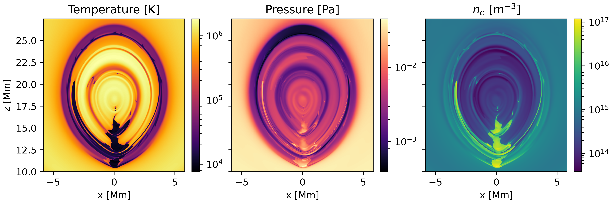{fig-align="center"}

::: {.attrib}
:::: {.columns}
::: {.column width=50%}
- 5.7 km resolution!
- 3072 x 2048
:::
::: {.column width=50%}
- 5+1 level H
- 5+1 level Ca ɪɪ
- Charge & pressure conservation
:::
::::
:::

## Short Characteristics Comparison

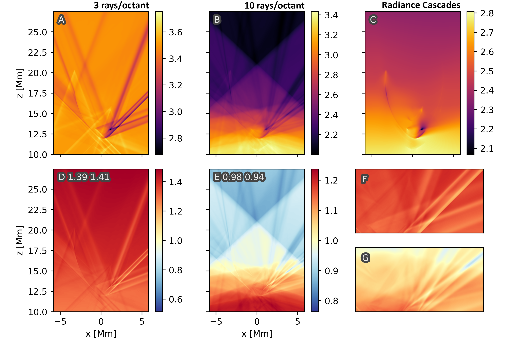{fig-align="center"}

## Spectra -- Ca ɪɪ K {.smaller}

::: {.horiz-center}

<video controls loop data-autoplay src="static_assets/Ca_II_393.48_nm.mp4" style="max-width: 80%;"></video>

:::

## Spectra -- Ly β {.smaller}

::: {.horiz-center}

<video controls loop data-autoplay src="static_assets/H_I_102.57_nm.mp4" style="max-width: 80%;"></video>

:::


## Ionisation Fraction {.smaller}

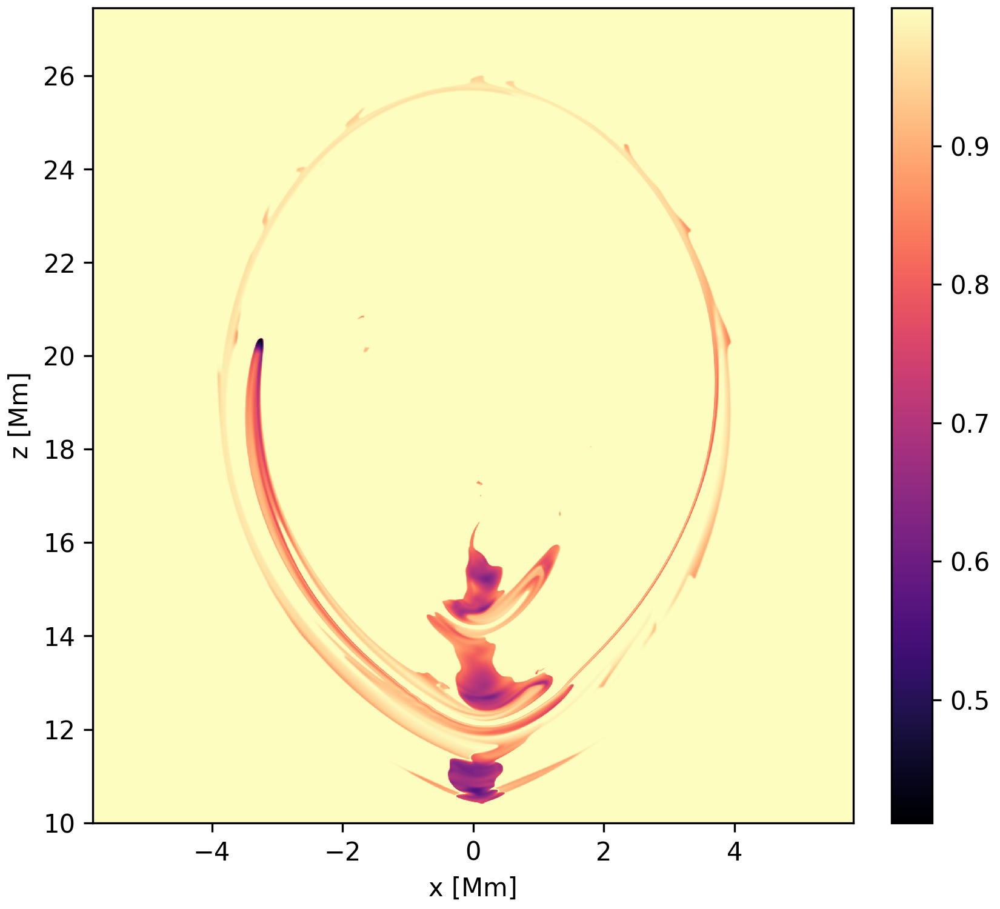{fig-align="center"}

# Outlook

## Ca ɪɪ K in 3D (Donné & Keppens) {.smaller}

::: {.horiz-center}

<video controls loop data-autoplay src="static_assets/K_core_2.mp4" style="max-width: 60%;"></video>

:::

## Ca ɪɪ K COCOPLOT {.smaller}

::: {.horiz-center}

<video controls loop data-autoplay src="static_assets/K_ccp_slit_1x_2.mp4" style="max-width: 75%;"></video>

:::

## Ly β COCOPLOT {.smaller}

::: {.horiz-center}

<video controls loop data-autoplay src="static_assets/lyb_ccp_slit_1x.mp4" style="max-width: 75%;"></video>

:::

## Outlook {.smaller}

:::: {.columns .v-center-container}

::: {.column width=80%}
- Radiative transfer effects are necessary for realistic solar models
  - Observational interpretation
  - Model synthesis
  - Ionisation effects
- Radiance cascades present viable route to non-LTE RMHD
  - SAMS Project
- And also to enhance radiation treatment across astrophysics
- GPUs are really powerful, and graphics programming has lots to offer us

<br/><br/>
[Thanks!]{style="color: var(--teal_c);"}

[Christopher.Osborne@glasgow.ac.uk](mailto:christopher.osborne@glasgow.ac.uk)
:::

::: {.column width=20%}
[](https://doi.org/10.1093/rasti/rzae062)
[Paper]{.attrib}
:::


::::

## 1.5D Comparison -- Prominence {.smaller}

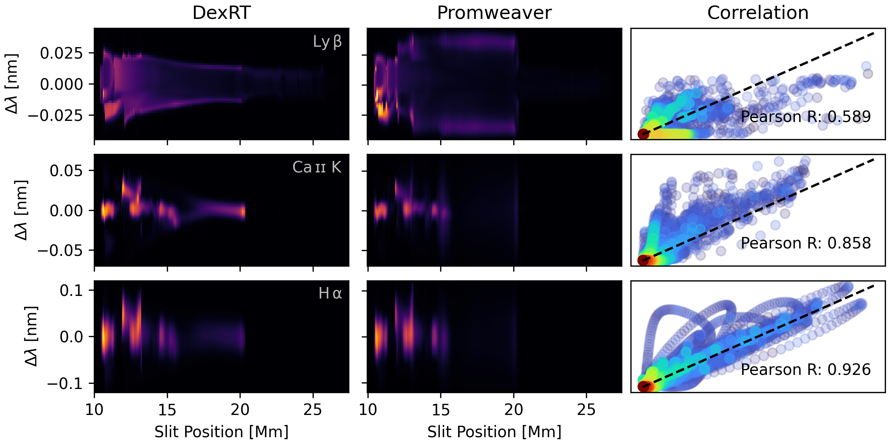{fig-align="center"}

## 1.5D Comparison -- Filament {.smaller}

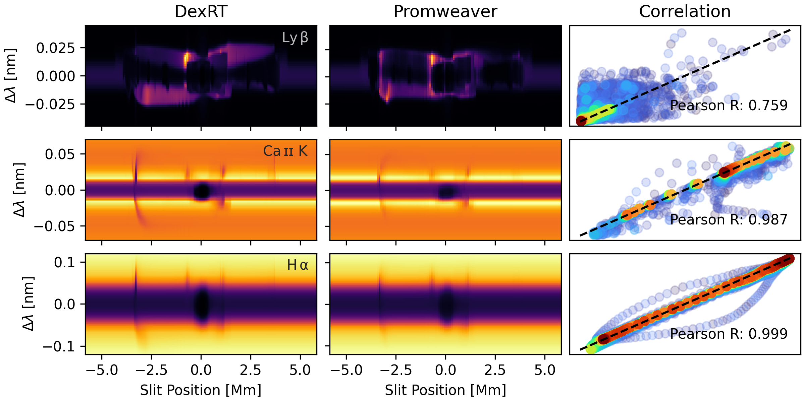{fig-align="center"}

## Line Formation -- Contribution Function {.smaller}

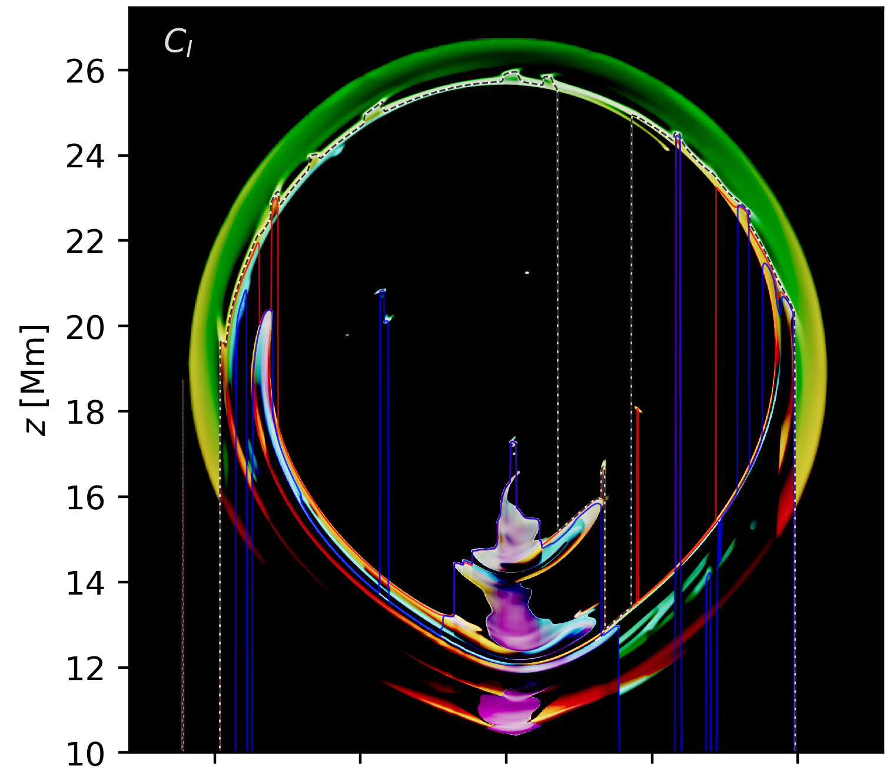{fig-align="center"}

## Line Formation -- $J_\nu$ {.smaller}

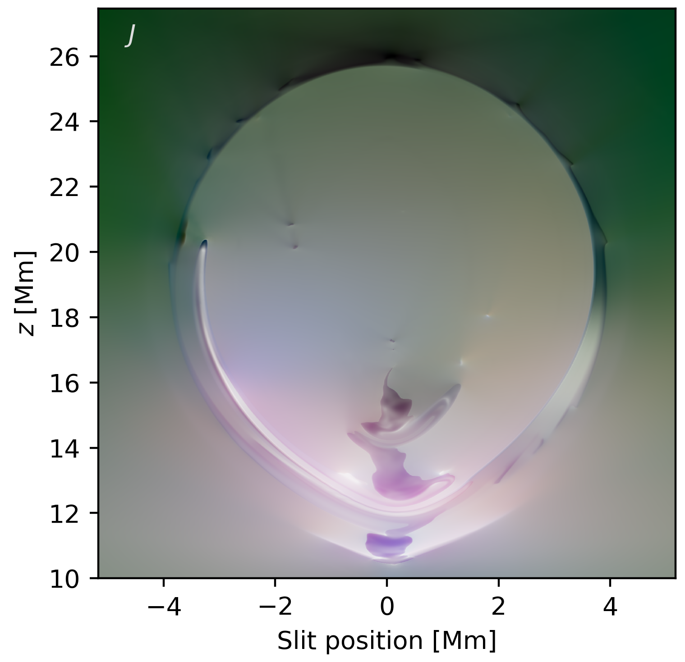{fig-align="center"}

