## Non-LTE Radiative Transfer {.smaller}

:::: {.columns .v-center-container}

::: {.column width="50%"}
- Coupling between radiation field and atomic transitions.
- Extremely computationally demanding, but necessary for many spectral lines.
- Also, ionisation.
:::

::: {.column width="50%"}
<video loop data-autoplay src="static_assets/hillier_polito_iris.mp4" width="99%"></video>

[IRIS (Hillier & Polito 2018)]{.attrib}
:::

::::

## State of the Art I {.smaller}

:::: {.columns .v-center-container}

::: {.column width="50%"}
- 1.5D and 2D simplified slabs.
- Postprocess multithread stacking (Gunar+ 2008, Peat+ Poster).
- Can produce complex line profiles, but how to motivate velocity distribution?
:::

::: {.column width="50%"}

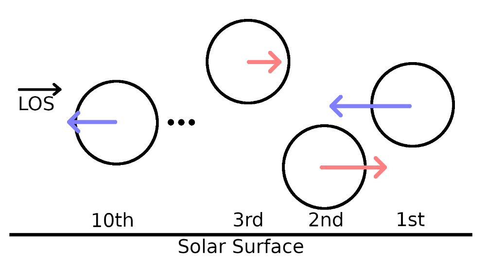{fig-align="center"}
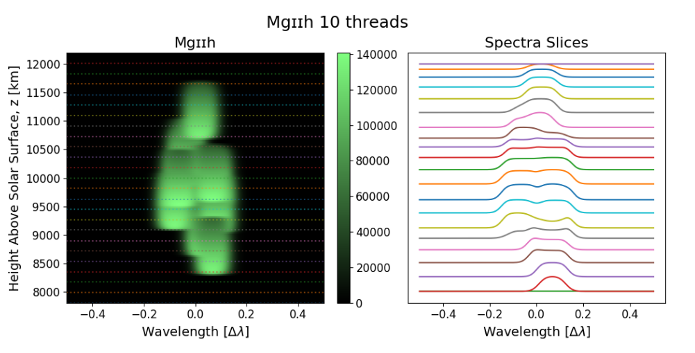{fig-align="center"}
[Peat+ 2023]{.attrib}

:::
::::

## State of the Art II {.smaller}

:::: {.columns .v-center-container}

::: {.column width="50%"}
- MHD prominence models have advanced dramatically in the last decade.
- Radiative loss approaches have lagged behind (especially vs chromosphere).
- Adopting 1.5D column-by-column approach from chromospheric modelling.
:::

::: {.column width="50%"}

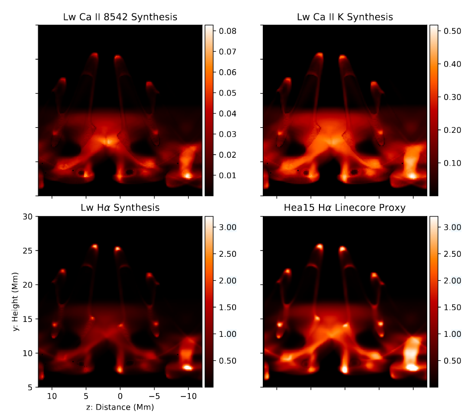{fig-align="center"}
[Jenkins+ 2023]{.attrib}

:::
::::

## But how do we gain insights on observations like this? {.smaller}

::: {.horiz-center}
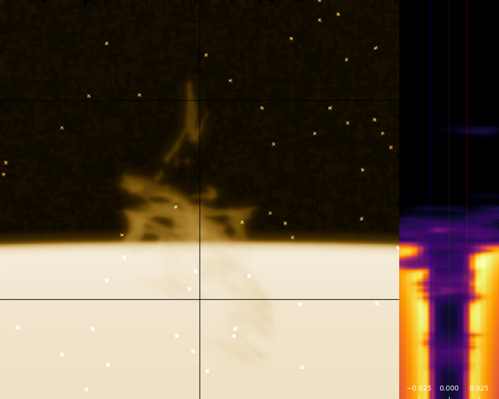{fig-align="center" height=520px}

[IRIS Mg ɪɪ k]{.attrib}
:::

## Ray Effects

{fig-align="center"}

## Desired Result

{fig-align="center"}

## Radiance Cascades: Redux {.smaller}

:::: {.columns .v-center-container}

::: {.column width="60%"}

- Linear light source and blocker:

```{=tex}
\begin{cases}
A < B,\\
\alpha > \beta.
\end{cases}
```
with some small angles approximations...
```{=tex}
\begin{cases}
\Delta_s < F(D) \propto D\quad&\mathrm{(spatial)}\\
\Delta_\omega < G(1/D) \propto 1/D\quad&\mathrm{(angular)}
\end{cases}
```

- We can exploit this!
- Represent contributions from different shells separately.

:::

::: {.column width="50%"}


:::
::::

{{ RcProbeNear }}

{{ RcProbeFar }}

{{ ProbeGrid }}

## How do we use this? {.smaller}

::: {.columns .v-center-container}

::: {.column}
- Encode radiance field as a set of cascades, each describing $I_\nu$ in annuli around $\vec{p}$.
- If penumbra criterion is satisfied, cascade is linearly interpolateable!
  - Serves as Nyquist criterion

::: {.fragment}
- Interpolation leads to reuse of rays in upper cascades and the effective construction of exponentially more rays than computed directly.
:::

:::
:::

# Science!

## The Model {.smaller}

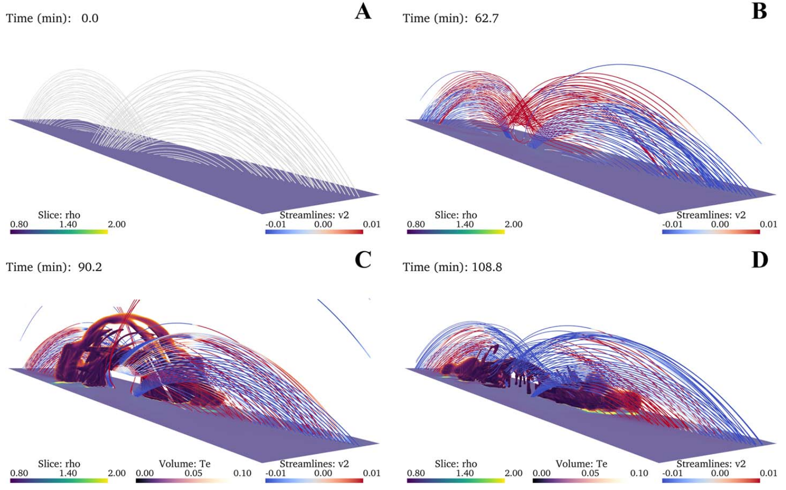{fig-align="center"}

[Donné & Keppens 2024]{.attrib}

## Ly β COCOPLOT {.smaller}

::: {.horiz-center}

<video controls loop data-autoplay src="static_assets/lyb_ccp_wings.mp4" style="max-width: 75%;"></video>

:::

## Mg ɪɪ k COCOPLOT {.smaller}

::: {.horiz-center}

<video controls loop data-autoplay src="static_assets/Mgk_orbit_bettertonemap.mp4" style="max-width: 75%;"></video>

:::

## Diving into the lines I {.smaller}

::: {.horiz-center}
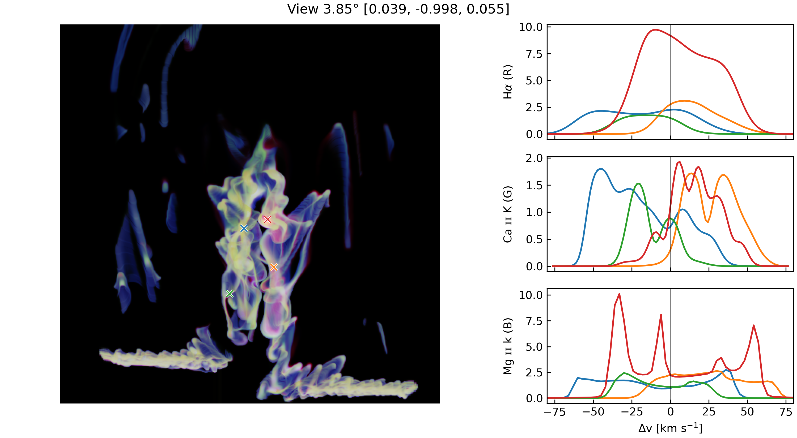{height=300px fig-align="center"}
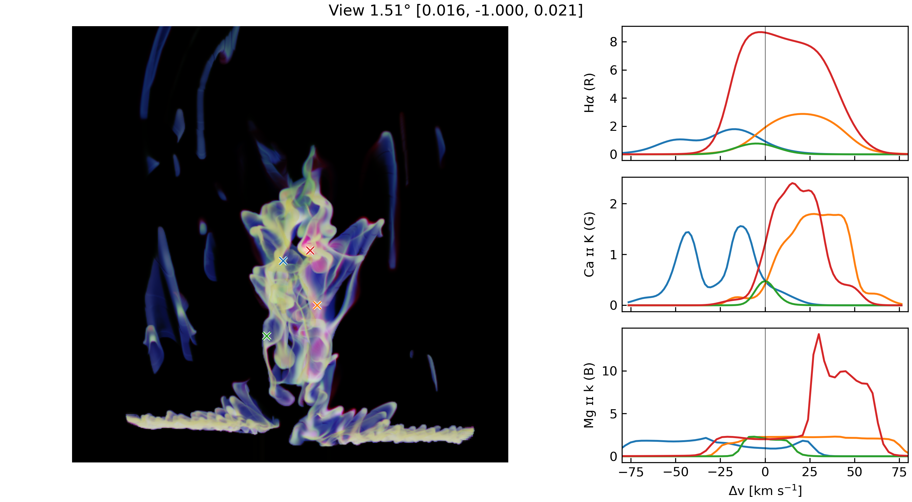{height=300px fig-align="center"}
:::

## Diving into the lines II {.smaller}

::: {.horiz-center}
{height=300px fig-align="center"}
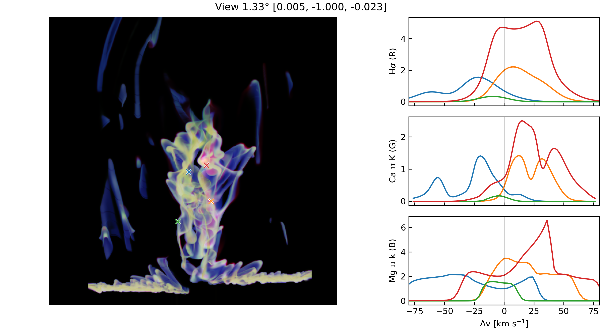{height=300px fig-align="center"}
:::

## Takeaways {.smaller}

:::: {.columns .v-center-container}

::: {.column width=80%}
- Simulation structures are typically axis aligned.
- Significant complexity arises from looking outside this alignment.
- The next step in meaningfully interpreting these structures will come from multi-line inversions.
- Radiative losses and ionisation are model dependent, but what generalities can we extract?
  - How does a detailed radiation treatment affect formation and evolution?
  - Work in progress!
- These new techniques will also feed into SAMS.

<br/><br/>
[Thanks!]{style="color: var(--teal_c);"}

[Christopher.Osborne@glasgow.ac.uk](mailto:christopher.osborne@glasgow.ac.uk)
:::

::: {.column width=20%}
[](https://doi.org/10.1093/rasti/rzae062)
[Paper]{.attrib}
:::

::::

## Spatially Convolved Lines I {.smaller}

::: {.horiz-center}
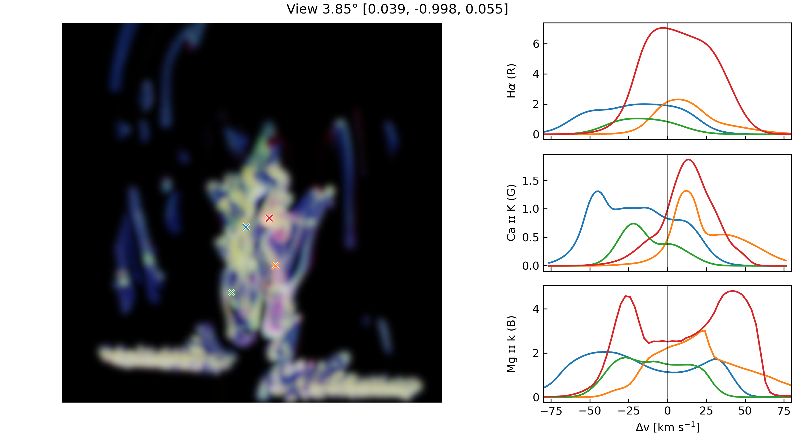{height=300px fig-align="center"}
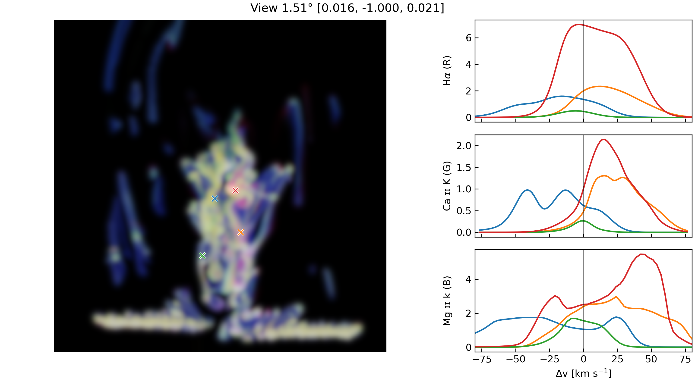{height=300px fig-align="center"}
:::

## Spatially Convolved Lines II {.smaller}

::: {.horiz-center}
{height=300px fig-align="center"}
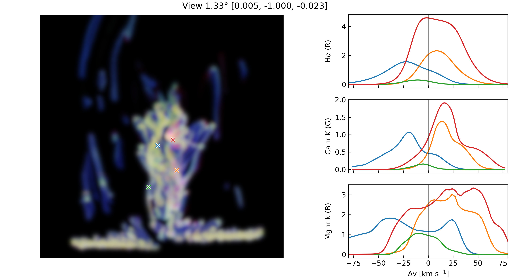{height=300px fig-align="center"}
:::

## 1.5D Comparison -- Prominence {.smaller}

{fig-align="center"}

## 1.5D Comparison -- Filament {.smaller}

{fig-align="center"}

## Line Formation -- Contribution Function {.smaller}

{fig-align="center"}

## Line Formation -- $J_\nu$ {.smaller}

{fig-align="center"}

