## Non-LTE Radiative Transfer {.smaller}

:::: {.columns .v-center-container}

::: {.column width="50%"}
- Coupling between radiation field and atomic transitions.
- Extremely computationally demanding, but necessary for many spectral lines.
- Also determines ionisation.
:::

::: {.column width="50%"}
<video loop data-autoplay src="static_assets/HinodeProm.mp4" width="99%"></video>

[HINODE BFI]{.attrib}
:::

::::

## The Solar Atmosphere {.smaller}

:::: {.columns .v-center-container}

::: {.column width="50%"}
- Information in these narrow wavebands samples different regions of the solar atmosphere.
- But not uniquely determined by a single region...
:::

::: {.column width="50%"}
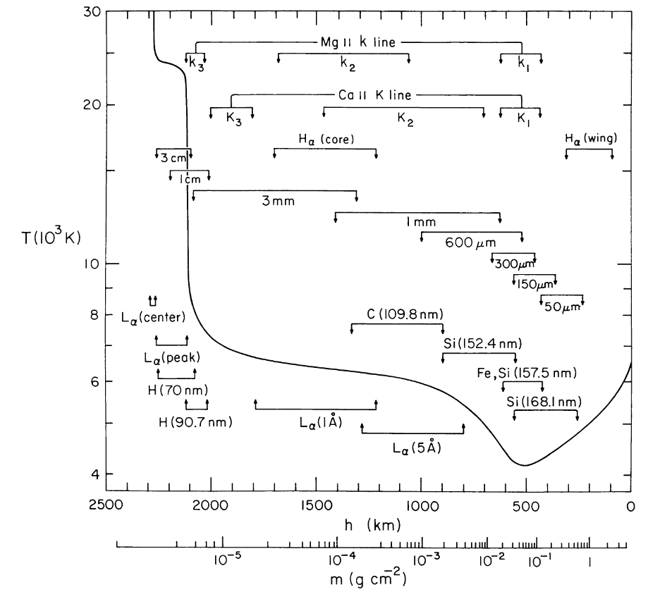{ #blah}
:::

::::

## Most Important Quantities {.smaller}

::: {.v-center-container .horiz-center}

::: {.column}

- Radiative rates depend on intensity.
- Intensity depends on radiative rates.

:::{.fragment}
<br/>
```{=tex}
\begin{align*}
    J_\nu(\vec{p}) &= \frac{1}{4\pi}\oint_\mathbb{S^2} I_\nu(\vec{p},\hat{\omega}) \mathop{d \hat{\omega} } \\
    &\vec{p} \in \mathbb{R}^2, \hat{\omega} \in \mathbb{S}^2\\
\end{align*}
```

- Specific intensity and its first moment.
- 3 and 5 dimensional functions! (+ wavelength...)
- Recursive component solved by fixed-point iteration in the atomic populations.
:::
:::
:::


## Current Methods {.smaller}

:::: {.columns .v-center-container}

::: {.column width="50%"}
- RT codes designed around the idea of smooth atmospheres...

::: {.incremental}
- But ours look like this
:::
:::

::: {.column width="50%" .r-stack}

::: {.fragment .current-visible}
{style="max-width: 80%;"}

[Jenkins & Keppens 2021]{.attrib}
:::

::: {.fragment .current-visible}
{style="max-width: 80%;"}

[Carlsson+ 2016]{.attrib}
:::

::: {.fragment .current-visible}
{style="max-width: 80%;"}

[Przybylski+ 2022]{.attrib}
:::

:::

::::


## Flare Observations {.smaller}

:::: {.columns .v-center-container}

::: {.column width="50%"}
- And observations of flares are hardly smooth.

:::

::: {.column width="50%" .r-stack}

::: {.current-visible}
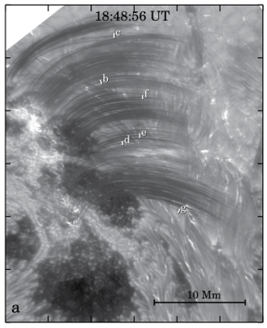{style="max-width: 80%;"}

[NST/BBSO, Jing et al (2016)]{.attrib}
:::
:::
::::

## Simplest 2D Chromospheric Model {.smaller}

:::: {.columns .v-center-container}

::: {.column width="50%"}
- How are line-profiles affected by 2D transfer effects?
- Quiet Sun atmosphere surrounding a flare kernel
  - 125, 250, 500 km widths
  - Flare-kernel thermodynamics from RADYN.
- Time-dependent ionisation
  - Charge conservation
- No energy feedback into kernel.

:::

::: {.column width="40%" .r-stack}

::: {.current-visible}
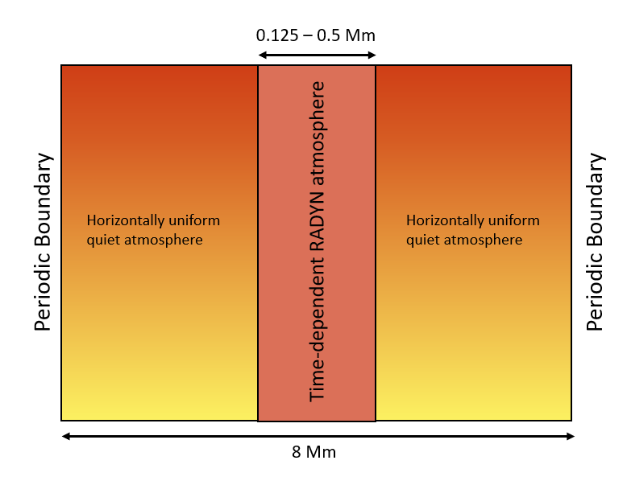{style="max-width: 80%;"}

:::
:::
::::

## 125 km Kernel - Hα {.smaller}

::: {.v-center-container}
::: {.horiz-center}
<video controls loop data-autoplay src="static_assets/2d_flare_ha_125_re.mp4"></video>
Intensity along cuts ([red]{style="color: #F06C25;"}, [green]{style="color: #71A72C;"}, [blue]{style="color: #5283A5;"}), and [equivalent plane-parallel model]{style="color: #F197D1;"}.
:::
:::

## 500 km Kernel - Ca ɪɪ 8542 {.smaller}

::: {.v-center-container}
::: {.horiz-center}
<video controls loop data-autoplay src="static_assets/2d_flare_8542_500_re.mp4"></video>
Intensity along cuts ([red]{style="color: #F06C25;"}, [green]{style="color: #71A72C;"}, [blue]{style="color: #5283A5;"}), and [equivalent plane-parallel model]{style="color: #F197D1;"}.
:::
:::

## Interesting Differences {.smaller}
::: {.v-center-container}
::: {.horiz-center}
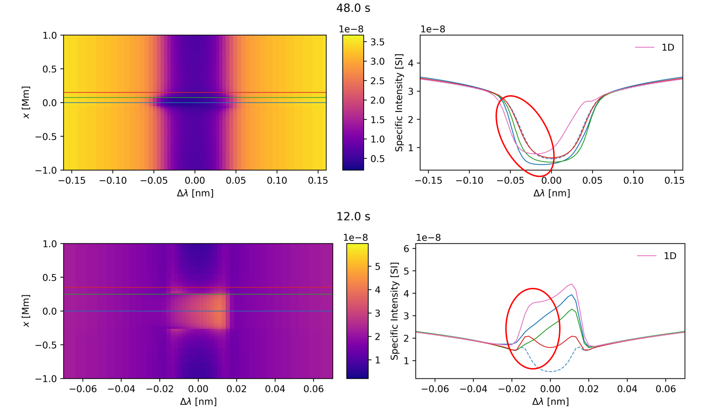{style="max-width: 80%;"}
:::
:::

## Line Formation Heights {.smaller}
::: {.v-center-container}
::: {.horiz-center}
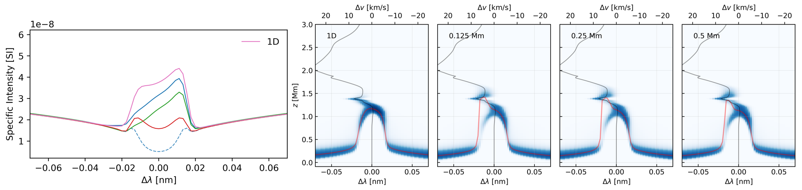{style="max-width: 100%;"}

Even 500 km does not come close to the formation height found in the plane-parallel models.
:::
:::

## Radiative Losses {.smaller}
::: {.v-center-container}
::: {.horiz-center}
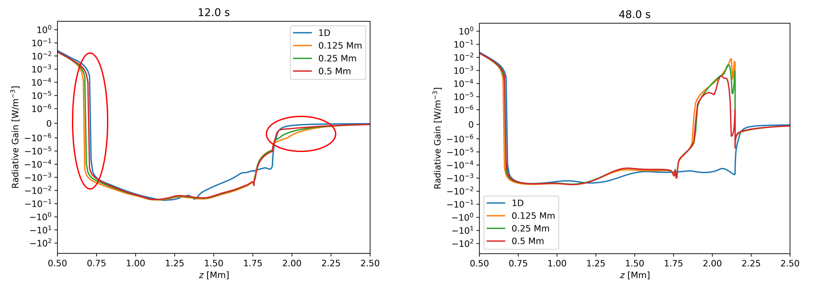{style="max-width: 100%;"}

Estimate since this simple model is not energetically consistent.
:::
:::

## Motivating Proto-Conclusions {.smaller}

<br/>

::: {}
- Radiation can propagate energy free from the magnetic field.
- 2+D radiative transfer for flares really matters.
- Formation heights change.
  - Losses and gains change too.
- Filling factors aren't uniform in wavelength over a line.
:::

[So...]{style="color: var(--teal_c);" .fragment}

::: {.fragment}
- Efficient higher dimensionality treatments are needed.
- Plane-parallel can have high error.
- A few niggles with the radiation field.
:::

# Taking a step back...

## Who recognises this? {.smaller}

::: {.horiz-center}

{fig-align="center" height=520px}

[Cornell University]{.attrib}

:::

## And how does it connect to this? {.smaller}

::: {.horiz-center}

{fig-align="center" height=520px}

[VLT (ESO)]{.attrib}

:::

## Physics! {.smaller}

```{=tex}
\begin{align*}
(\hat{\omega} \cdot \nabla) L(\vec{p}, \hat{\omega}) = &-\chi(\vec{p}, \hat{\omega}) L(\vec{p}, \hat{\omega}) \\
&+ \eta(\vec{p}, \hat{\omega}) \\
&+ \sigma_s(\vec{p}, \hat{\omega}) \oint_{\mathbb{S}^2} p(\vec{p}, \hat{\omega}^\prime, \hat{\omega}) L(\vec{p}, \hat{\omega}^\prime)\, d\hat{\omega}^\prime
\end{align*}
```

- $L$ radiance,
- $\eta$ emission coefficient,
- $\chi$ absorption coefficient,
- $\sigma_s$ scattering coefficient,
- $p$ phase function.


[Key takeaway: this is a recursive integro-differential equation!]{style="color: var(--teal_c);"}


## Prominence Albedo

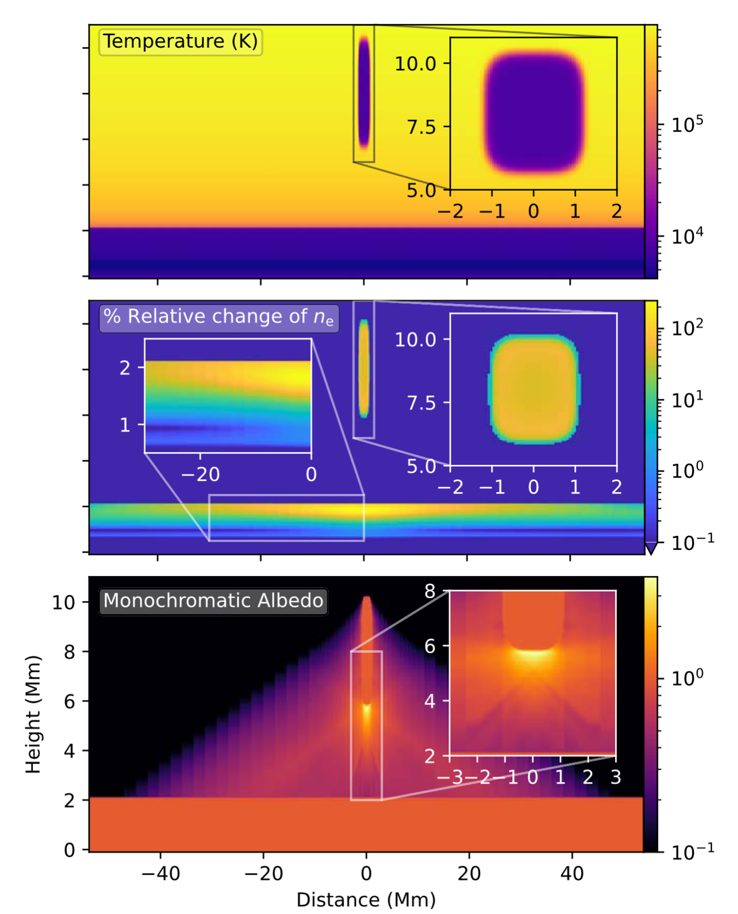{fig-align="center"}

## Monte Carlo

::: { #figg-montecarlo layout-ncol=2}

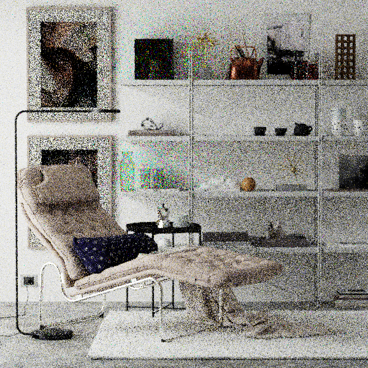{ #figg-8spp}

{ #figg-8192spp}

:::

::: {.horiz-center}
[Jenkins+ 2024]{.attrib}
:::


## Ray Effects

{fig-align="center"}

## Desired Result

{fig-align="center"}

## Tricky Radiation {.smaller}

::: {.columns .v-center-container}

:::: {.column width="80%"}

- In the steady-state solution of radiative transfer coupling is [global.]{style="color: var(--teal_c);"}
- This hinders parallelisation.
- Monte Carlo approaches have poor convergence rates.
- [Is there some middle ground?]{style="color: var(--teal_c);"}

::: {.fragment}
- Video games are now solving an adjacent problem at reasonable resolutions _hundreds_ of times a second on single workstations...
:::
::::
:::

## Aside: Everything Old is New Again {.smaller}

:::: {.columns .v-center-container}

::: {.column width="50%"}
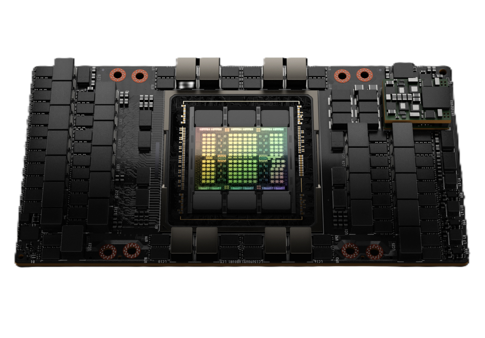{fig-align="center" height=400px #blahh}
:::

::: {.column width="50%"}
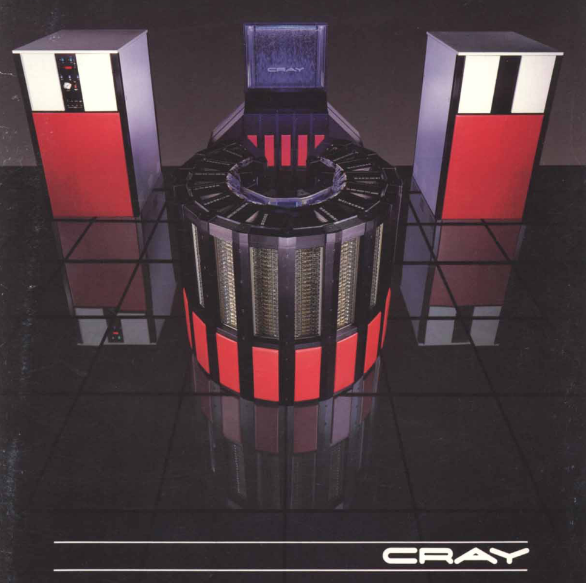{fig-align="center" height=480px #blahh}
:::

::::

## Radiance Cascades {.smaller}

::: {.v-center-container}

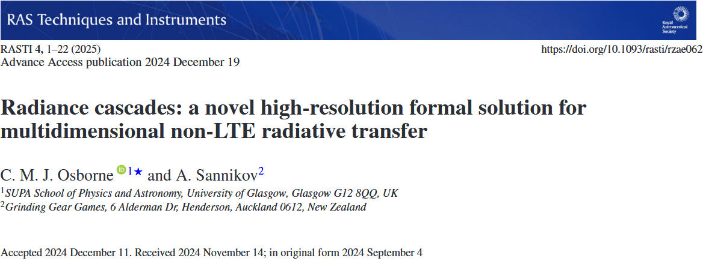{fig-align="center"}

:::

{{ PenumbraCriterion }}

## Radiance Cascades: Observations {.smaller}

:::: {.columns .v-center-container}

::: {.column width="60%"}

- Linear light source and blocker:

```{=tex}
\begin{cases}
A < B,\\
\alpha > \beta.
\end{cases}
```
with some small angles approximations...
```{=tex}
\begin{cases}
\Delta_s < F(D) \propto D\quad&\mathrm{(spatial)}\\
\Delta_\omega < G(1/D) \propto 1/D\quad&\mathrm{(angular)}
\end{cases}
```

- We can exploit this!
- Represent contributions from different shells separately.

:::

::: {.column width="50%"}


:::
::::

{{ RcProbeNear }}

{{ RcProbeFar }}

{{ ProbeGrid }}

## How do we use this? {.smaller}

::: {.columns .v-center-container}

::: {.column}
- Encode radiance field as a set of cascades, each describing $I_\nu$ in annuli around $\vec{p}$.
- If penumbra criterion is satisfied, cascade is linearly interpolateable!
  - Serves as Nyquist criterion

- The cascades sparsely encode the radiation field throughout the domain...
- But not in a form we can use directly.
- Solution:

::: {.fragment .horiz-center}
<br/>[Interpolation. But with minimal error.]{style="color: var(--teal_c);"}
:::

::: {.fragment}
- Interpolation leads to reuse of rays in upper cascades and the effective construction of exponentially more rays than computed directly.
:::

:::
:::

## Mipmaps I {.smaller}

- We can employ lower resolution proxies for distant rays: mipmaps (recursive spatial averaging) with directionality and adaptive error bounds (variance of log emissivity and opacity), and also skip empty space

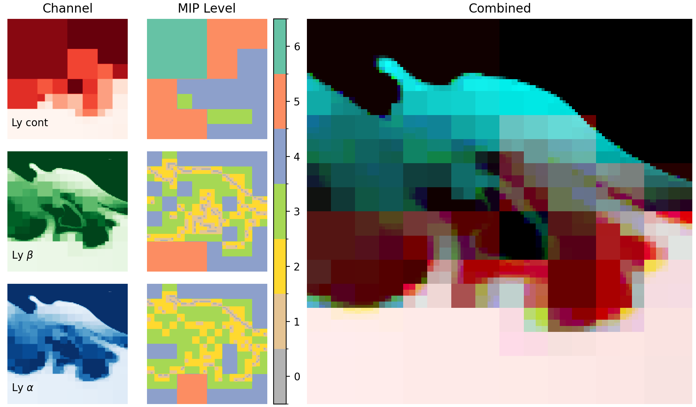{fig-align="center"}

- Inspired by OpenVDB and longstanding computer graphics practices.

## Mipmaps II {.smaller}

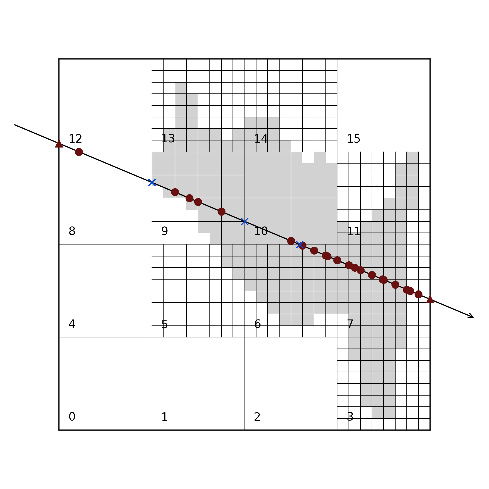{fig-align="center"}

- Can be efficiently traversed using a hierarchical scheme.
- This technique has provided a further order of magnitude speedup on typical models.

## Mipmaps III {.smaller}

- This approach adapts automatically during the iterative solution!

::: {.horiz-center}
<video controls loop data-autoplay src="static_assets/lyb_blocks.mp4" style="max-width: 75%;"></video>

:::

## Ly β COCOPLOT (Donné & Keppens) {.smaller}

::: {.horiz-center}

<video controls loop data-autoplay src="static_assets/lyb_ccp_slit_1x.mp4" style="max-width: 75%;"></video>

:::


## Mg ɪɪ k COCOPLOT {.smaller}

::: {.horiz-center}

<video controls loop data-autoplay src="static_assets/Mgk_orbit_bettertonemap.mp4" style="max-width: 75%;"></video>

:::

## Diving into the lines I {.smaller}

::: {.horiz-center}
{height=300px fig-align="center"}
{height=300px fig-align="center"}
:::

## Diving into the lines II {.smaller}

::: {.horiz-center}
{height=300px fig-align="center"}
{height=300px fig-align="center"}
:::


## Outlook {.smaller}

:::: {.columns .v-center-container}

::: {.column width=80%}
- This barely scratches the surface of interdisciplinary computational work, especially for radiation.
  - Need to develop common language between fields.
- Radiance cascades provide the first meaningful change to solar non-LTE RT in 30 years and it came from outside the field.
  - This work will grow part of the recently funded STFC large award for the Solar Atmospheric Modelling Suite over the next few years.
  - More efficient cascade designs are being developed.

<br/><br/>
[Thanks!]{style="color: var(--teal_c);"}

[Christopher.Osborne@glasgow.ac.uk](mailto:christopher.osborne@glasgow.ac.uk)
:::

<!-- ::: {.column width=20%}
[](https://doi.org/10.1093/rasti/rzae062)
[Paper]{.attrib}
::: -->

::::

## Spatially Convolved Lines I {.smaller}

::: {.horiz-center}
{height=300px fig-align="center"}
{height=300px fig-align="center"}
:::

## Spatially Convolved Lines II {.smaller}

::: {.horiz-center}
{height=300px fig-align="center"}
{height=300px fig-align="center"}
:::

## 1.5D Comparison -- Prominence {.smaller}

{fig-align="center"}

## 1.5D Comparison -- Filament {.smaller}

{fig-align="center"}

## Line Formation -- Contribution Function {.smaller}

{fig-align="center"}

## Line Formation -- $J_\nu$ {.smaller}

{fig-align="center"}